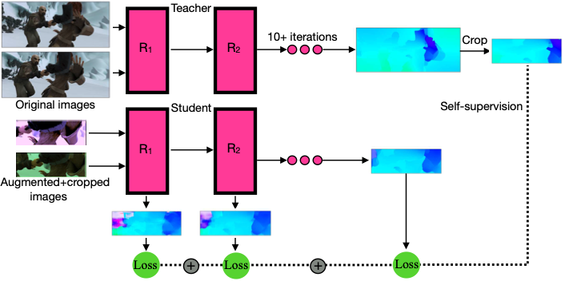

# SMURF: Self-Teaching Multi-Frame Unsupervised RAFT with Full-Image Warping

[](LICENSE)

Unofficial **PyTorch** (inference only) reimplementation of the CVPR 2021
paper [SMURF: Self-Teaching Multi-Frame Unsupervised RAFT with Full-Image Warping](https://arxiv.org/abs/2105.07014)
by Austin Stone et al. (Google Research).

<p align="center">
  
</p>

Figure taken from [paper](https://arxiv.org/pdf/2105.07014.pdf).

## Requirements

To perform inference with the SMURF RAFT model it is just required to install PyTorch and TorchVision.
See [`requirements.txt`](requirements.txt) for details.

Note: to convert the original checkpoints it is also required to install Tensorflow 2.0.

## Port weights

As the official SMURF implementation does not provide a license for their checkpoints this repo does not include the
converted PyTorch checkpoints. However, you can convert the official Tensorflow checkpoints with the
provided [`convert_weights_to_pt.py`](convert_weights_to_pt.py) script.

You can download the original checkpoints [here](https://github.com/google-research/google-research/tree/master/smurf).

For converting an original checkpoint (e.g. Kitti checkpoint) to PyTorch just run:

```bash
python convert_weights_to_pt.py --tf_checkpoint "path/to/checkpoint/smurf-kitti-smurf-ckpt-31" --pt_checkpoint_path "smurf_kitti.pt"
```

## Perform inference

To load the converted checkpoint and perform inference you can run:

```python
from typing import List

import torch.nn as nn
import torchvision
from torch import Tensor

from smurf import raft_smurf

# Load images
image1: Tensor = torchvision.io.read_image("toy_data/reds/00000000.png", mode=torchvision.io.ImageReadMode.RGB)
image2: Tensor = torchvision.io.read_image("toy_data/reds/00000004.png", mode=torchvision.io.ImageReadMode.RGB)
# Normalize images to the pixe range of [-1, 1]
image1 = 2.0 * (image1 / 255.0) - 1.0
image2 = 2.0 * (image2 / 255.0) - 1.0
# Init SMURF RAFT model
model: nn.Module = raft_smurf(checkpoint="smurf_kitti.pt")
# Predict optical flow
optical_flow: List[Tensor] = model(image1[None], image2[None])
```

The resulting flow should look like this:

<p align="center">
  
</p>

A full inference script with flow visualization is provided in [`perform_inference.py`](perform_inference.py).

## Implementation details

This implementation is mainly based on
[TorchVision's RAFT implementation](https://github.com/pytorch/vision/blob/main/torchvision/models/optical_flow/raft.py)
([BSD 3-Clause License](https://github.com/pytorch/vision/blob/main/LICENSE)). However, the official SMURF RAFT
implementation contains minor implementation differences. This implementation has modified TorchVision's RAFT
implementation to match the official SMURF RAFT implementation. For more details please refer to
this [GitHub issue](https://github.com/google-research/google-research/issues/1883).

## Reference

```bibtex
@inproceedings{Stone2021,
    title={SMURF: Self-Teaching Multi-Frame Unsupervised RAFT with Full-Image Warping},
    author={Stone, Austin and Maurer, Daniel and Ayvaci, Alper and Angelova, Anelia and Jonschkowski, Rico},
    booktitle={CVPR},
    year={2021}
}
```

```bibtex
@inproceedings{Nah2019,
  author={Nah, Seungjun and Baik, Sungyong and Hong, Seokil and Moon, Gyeongsik and Son, Sanghyun and Timofte, Radu and Lee, Kyoung Mu},
  title={NTIRE 2019 Challenge on Video Deblurring and Super-Resolution: Dataset and Study},
  booktitle={CVPRW},
  year={2019}
}
```